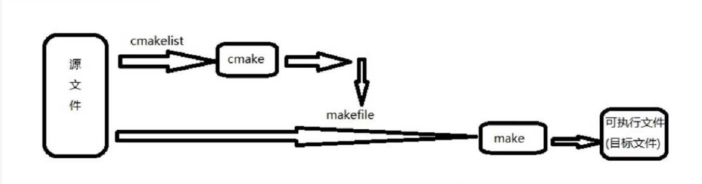

#首先，CMake与Make，gcc都是源代码编译工具，链接后生成 exe 程序的工具或者工具库来着。

1、gcc：当你的程序只有一个源文件时，直接就可以用gcc命令编译它。 例如命令：<gcc main.c>生成一个main.out可执行文件；

2、make：当有多个源文件时，gcc一个一个去搞就头大了，这时候可以通过make，用Makefile组织好，批处理编译。
曾经写过一篇讲解Makefile的日志：https://blog.csdn.net/txpp520/article/details/103993404

3、CMake：CMake是一种跨平台编译工具，比make更为高级，使用起来要方便得多。


#总结：
```
对于一个大工程，编写makefile实在是件复杂的事，于是人们又想，为什么不设计一个工具，读入所有源文件之后，
自动生成makefile呢，于是就出现了cmake工具，它能够输出各种各样的makefile或者project文件，从而帮助程序员减轻负担。
但是随之而来也就是编写CMakeLists文件，它是cmake所依据的规则。所以在编程的世界里没有捷径可走，还是要脚踏实地的。
所以流程如下：
```
    
